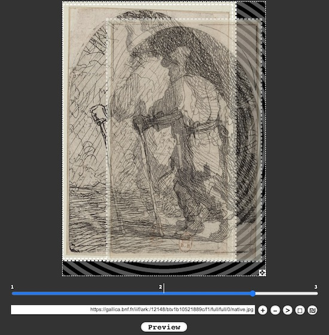
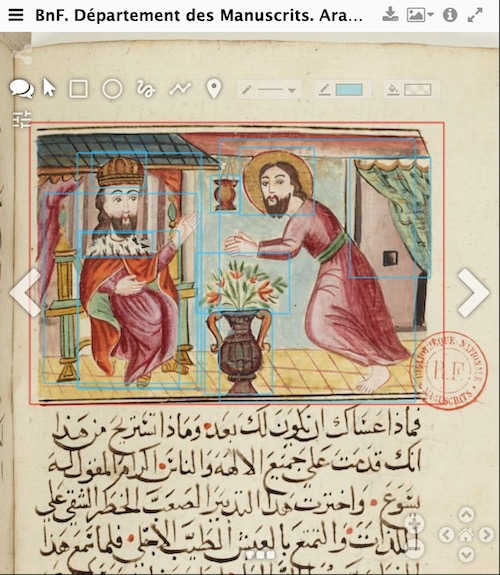

# IIIF Experiments

This repository shows some IIIF experiments based on [Gallica](gallica.bnf.fr) content and real life use cases when working with IIIF documents.

- [*Comparing Documents and Images*](#comparing-documents-and-images)
- [*Deep Zoom with large images*](#deep-zoom-with-large-images)
- [*IIIF Collections*](#iiif-collections)
- [*IIIF Annotations*](#iiif-annotations)
- [*IIIF Range*](#iiif-range)
- [*IIIF and OCR*](#iiif-and-ocr)
- [*IIIF and A/V*](#iiif-and-av)
- [*IIIF Curation*](#iiif-curation)
- [*IIIF Stories*](#iiif-stories)

***

## Comparing Documents and Images

### Comparing Documents with Mirador
Comparing images was one of the initial objectives of the IIIF initiative. Just drag and drop the IIIF icons in any IIIF viewer (like this [one](https://manuscrits-france-angleterre.org/view3if/?target=https://gallica.bnf.fr/iiif/ark:/12148/bpt6k9907264/manifest.json)) to open side by side a BnF and a Standford digital edition of *Sidereus nuncius, magna... spectacula pandens... quae a Galileo Galileo,...* ([RES P-V-743](https://gallica.bnf.fr/ark:/12148/bpt6k9907264/))

[Gallica IIIF manifest](https://gallica.bnf.fr/iiif/ark:/12148/bpt6k9907264/manifest.json)

[](https://gallica.bnf.fr/iiif/ark:/12148/bpt6k9907264/manifest.json)


[Standford Libraries IIIF manifest](https://purl.stanford.edu/tm309fq4104/iiif/manifest)

[](https://purl.stanford.edu/tm309fq4104/iiif/manifest.json)

[](https://manuscrits-france-angleterre.org/view3if/?target=https://gallica.bnf.fr/iiif/ark:/12148/bpt6k9907264/manifest.json)

### Comparing Documents and Images with Mirador
Comparing a IIIF document and a local images is also possible in [Mirador 3](https://projectmirador.org/embed/?iiif-content=). Open this [black & white photo](https://gallica.bnf.fr/ark:/12148/btv1b531454753) in Mirador 3 using the drag-and-drop technique: 

[](https://gallica.bnf.fr/ark:/12148/btv1b531454753?manifest=https://gallica.bnf.fr/iiif/ark:/12148/btv1b531454753/manifest.json)

Then download its [colorized](images/btv1b531454753-Enhanced-Colorized.jpg) version (produced with [DeOldify](https://www.myheritage.fr/incolor/))  on your disk. Finally, drag and drop the image file in Mirador.

[](https://projectmirador.org/embed/?iiif-content=https://gallica.bnf.fr/iiif/ark:/12148/btv1b531454753/manifest.json)

### Creating a mixed Manifest including Documents and Images

A [mixed manifest](manifests/colorized-manifest.json) may also be build agregating the non IIIF colorized version and the original IIIF document as a sequence of canvas. Open it in [Mirador 3](https://projectmirador.org/embed/?iiif-content=https://raw.githubusercontent.com/altomator/IIIF/main/manifests/colorized-manifest.json). (Based on [Glen Robson](https://glenrobson.github.io/) sample.)

[](https://projectmirador.org/embed/?iiif-content=https://raw.githubusercontent.com/altomator/IIIF/main/manifests/colorized-manifest.json)


### Layering Multiple Images

Digitally layering multiple images can also be needed for specific use cases. Each image can be gradually exposed by the user to allow the differences to be compared (e.g. the [Raphael Cartoons](https://www.vam.ac.uk/articles/explore-the-raphael-cartoons#slideshow=3891&slide=0), Victoria and Albert Museum)

First, the [Compariscope](https://github.com/vanda/iiif-features#the-compariscope) utility app (Luca Carini, V&A) can be used to align IIIF documents. In this example, we align three states of a [Rembrandt engraving](https://gallica.bnf.fr/ark:/12148/btv1b105218666?rk=343349;2). A the end of the editing, we copy the alignment data into the manifest.

Click on the illustration bellow to open Compariscope on the Rembrandt example, built with a [IIIF manifest](https://raw.githubusercontent.com/altomator/IIIF/main/manifests/layerstack-rembrandt.json) listing 3 Gallica documents.

[](https://vanda.github.io/iiif-features/compariscope.html?manifest=https://raw.githubusercontent.com/altomator/IIIF/main/manifests/layerstack-rembrandt.json)

Then the manifest is visualised using [LayerStack](https://github.com/vanda/layerstack), a viewer based on OpenSeaDragon. Click on the illustration to see the result.

[](https://altomator.github.io/IIIF/#0)

Other apps like [Leaflet-iiif](https://github.com/mejackreed/Leaflet-IIIF) offer different approaches for layering images. Leaflet-iiif is a JavaScript library for creating zoomable views of IIIF images. In this [example](https://altomator.github.io/IIIF/index-leaflet-colors.html) based on [https://bl.ocks.org/mejackreed](https://bl.ocks.org/mejackreed/raw/cc99c87a27542fdcd5987076549ff271/), we display side-by-side the original photograph from the above example and its colorized version (hosted by iiifhosting.com) 

[](https://altomator.github.io/IIIF/index-leaflet-colors.html)

This other [example](https://altomator.github.io/IIIF//index-leaflet_btv1b10303825m.html) displays the [Quinatzin Mapa](https://gallica.bnf.fr/ark:/12148/btv1b10303825m/f1), on which technical photography techniques have been applied (see [1](https://bnf.hypotheses.org/577) and [2](https://chsopensource.org/technical-photography-of-aztec-manuscripts-in-paris/) for details on the scientific background), and its ultra violet version. Mixing several techniques ( XRF or vis-NIR spectrophotometer, etc.) in addition to IR and fluorescent UV photographs helps to study the nature of the materials used. Traditionally, IR images are used alone to better see carbon black patterns (iron gall inks will be almost transparent in IR) but IR images are also used to produce false color images. By also using the visible images, it is sometimes possible to identify materials that appear similar in the visible but are different in the IR. Fluorescence under UV light can highlight materials that fluoresce (e.g. some organic materials used as binder or varnish). 

[](https://altomator.github.io/IIIF//index-leaflet_btv1b10303825m.html)

This last Leaflet-iiif example derived from [https://bl.ocks.org/mejackreed](https://bl.ocks.org/mejackreed/6e3fb8e69189dadb4be7d0926a6a14a5) uses the Leaflet plugin Icon Layers, which allows layers switching control with a set of icons. The previous example is now implemented with [IR and UV versions](https://altomator.github.io/IIIF//index-leaflet_selector.html).

[](https://altomator.github.io/IIIF//index-leaflet_selector.html)


## Deep zoom with large images

Large composite file of images can be fragmented into smaller tiled units allowing rapid load and smooth  deep zoom navigation in a browser.
This [example](https://dm0lds.wordpress.com/2018/11/02/20-370-visages/) makes use of OpenSeaDragon, an open-source, web-based viewer for high-resolution zoomable images.  OpenSeaDragon has [support](https://openseadragon.github.io/examples/tilesource-iiif/) for the IIIF Image API (this example is not IIIF-compliant).

[](http://www.euklides.fr/blog/altomator/Megapixel/Visages-1418.html)

*tbc: large Cassini map *


## IIIF Collections 

### For Periodicals

This basic [IIIF collection](https://iiif.io/api/presentation/2.1/#collection) describes a sub-collection of the [Vogue](https://gallica.bnf.fr/ark:/12148/cb343833568/date.item) magazine (French edition, 1920-1940), organized by publication date (year).

[cb343833568.json](https://raw.githubusercontent.com/altomator/IIIF/main/collection/selection/cb343833568.json) is the collection's manifest that can be opened in a IIIF compliant viewer like Mirador. 

```json
{
  "@context": "http://iiif.io/api/presentation/3/context.json",
  "id": "https://raw.githubusercontent.com/altomator/IIIF/main/collection/cb343833568.json",
  "type": "Collection",
  ...
  "related": [{
			"id": "https://gallica.bnf.fr/ark:/12148/cb343833568/date",
			"format": "text/html",
			"label": "Gallica periodical: Vogue"
		}, ...],
  "seeAlso": [...],
  "items": [
    {
      "id": "https://raw.githubusercontent.com/altomator/IIIF/main/collection/cb343833568-1920.json",
      "type": "Collection",
      "label": "Vogue (1920)"
    },{
      "id": "https://raw.githubusercontent.com/altomator/IIIF/main/collection/cb343833568-1921.json",
      "type": "Collection",
      "label": "Vogue (1921)"
    }, ...
      ]
  }
```

Each sub-collection must setup links to the IIIF document manifests (or to other sub-collections):

```json
{
	"@context": "http://iiif.io/api/presentation/3/context.json",
	"id": "https://raw.githubusercontent.com/altomator/IIIF/main/collection/cb343833568-1920.json",
	"type": "Collection",
	"label": "Vogue 1920",
	"description": "This collection gathers all the issues of the title Vogue for the year 1920",
	"attribution": "BnF - Gallica, gallica.bnf.fr",
	"logo": "https://gallica.bnf.fr/mbImage/logos/logo-bnf.png",
	"related": [{
			"id": "https://gallica.bnf.fr/ark:/12148/cb343833568/date1920",
			"format": "text/html",
			"label": { "fr": [ "Périodique Gallica : Vogue (1920)" ],"en": [ "Gallica periodical: Vogue (1920)" ] }
		}],
	"items": [{
		"id": "https://gallica.bnf.fr/iiif/ark:/12148/bpt6k9604118j/manifest.json",
		"type": "Manifest",
		"label": "Vogue, 15 juin 1920",
		
	},..
	]
}
```

The Biblissima Mirador 3 instance can be used to open this collection:
[https://iiif.biblissima.fr/mirador3/?iiif-content=https://raw.githubusercontent.com/altomator/IIIF/main/collection/selection/cb343833568.json](https://iiif.biblissima.fr/mirador3/?iiif-content=https://raw.githubusercontent.com/altomator/IIIF/main/collection/selection/cb343833568.json)

Once open, the collection can be browsed, starting from the Information side panel:

[](https://iiif.biblissima.fr/mirador3/?iiif-content=https://raw.githubusercontent.com/altomator/IIIF/main/collection/selection/cb343833568.json)


### For Thematic Collections

IIIF collections are also useful for organizing documents according to a filing plan. This example is inspired by a [Gallica selection](https://gallica.bnf.fr/html/und/litteratures/series-de-bande-dessinee) of comics published in the press. The [collection](https://raw.githubusercontent.com/altomator/IIIF/main/collection/collection-bd.json) (API Presentation [v3](https://iiif.io/api/presentation/3.0/#51-collection)) lists comics series as sub-collections. 

[](https://iiif.biblissima.fr/mirador3/?iiif-content=https://raw.githubusercontent.com/altomator/IIIF/main/collection/collection-bd.json)

Launching Mirador with both a comics sample and the collection (as in the screenshot) is done with some [Javascript](https://raw.githubusercontent.com/altomator/IIIF/main/collection/collection-bd.html):

```
...
windows: [
         {
           manifestId: 'https://gallica.bnf.fr/iiif/ark:/12148/bpt6k4130558s/manifest.json',
           canvasId: "https://gallica.bnf.fr/iiif/ark:/12148/bpt6k4130558s/canvas/f28" //open on image #28
         },
         {
           collectionPath: [
              "https://raw.githubusercontent.com/altomator/IIIF/main/collection/collection-bd.json"
            ] ,
            manifestId: "https://raw.githubusercontent.com/altomator/IIIF/main/collection/collection-bd.json"
         }
       ],
       catalog: [
         { manifestId: "https://raw.githubusercontent.com/altomator/IIIF/main/collection/collection-bd.json" },
       ]
...
```

Multiple collections can be used to organize a complex navigation scheme as Mirador windows. In this example, comic book content is organized around two entry points, by series and by authors.


This final example shows the complete Gallica thematic selection of [women's magazines](https://gallica.bnf.fr/html/presse-et-revues/presse-feminine) transcribes as a [IIIF collection](https://iiif.biblissima.fr/mirador3/?iiif-content=https://raw.githubusercontent.com/altomator/IIIF/main/collection/selection/presse_feminine.json). 

## IIIF Annotations

[IIIF annotations](https://iiif.io/api/presentation/3.0/#56-annotation) are a convenient way to disseminate annotations, transcriptions, comments, etc., that may have been produced regarding a specific image or region of an image. IIIF annotations follow the Open Annotations and the [W3C Web Annotation](http://w3.org/TR/annotation-model/) model for IIIF version 3.0.

### AI Annotations

This IIIF demonstration leverages the GallicaPix [objects detection](https://github.com/altomator/Image_Retrieval) data that are available when the GallicaPix database acts a IIIF annotations server.

1. From GallicaPix or using [this URL](https://manuscrits-france-angleterre.org/view3if/?target=https://gallica.bnf.fr/iiif/ark:/12148/bpt6k9604118j/manifest.json&page=11&lang=en), open the Vogue [June 1920](https://gallica.bnf.fr/ark:/12148/bpt6k9604118j/f11.item) issue in a Mirador instance, like the BnF https://manuscrits-france-angleterre.org/ portal.

[](https://manuscrits-france-angleterre.org/view3if/?target=https://gallica.bnf.fr/iiif/ark:/12148/bpt6k9604118j/manifest.json&page=11&lang=en)

2. Download the [GallicaPix IIIF annotations](https://raw.githubusercontent.com/altomator/IIIF/main/annotations/bpt6k9604118j_iiif.json) on your local disk. 
3. Load the annotations file in Mirador (on the upper right corner, Download button + Importing Annotation option).
4. Display the annotations (upper left corner, Toogle annotations button).


These annotations could even be searchable using the [IIIF Content Search API](https://iiif.io/api/search/1.0/).

### Scientific Annotations

Some of the Mandragore database's enlightened manscripts has been exported as [IIIF annotations](https://api.bnf.fr/fr/mandragore-echantillon-segmente-2019). After opening a [manuscript](https://manuscrits-france-angleterre.org/view3if/?target=https%3A%2F%2Fgallica.bnf.fr%2Fiiif%2Fark%3A%2F12148%2Fbtv1b8419219x%2Fmanifest.json&page=12&lang=en) in an Mirador instance, one can visualize the [Mandragore annotations](https://raw.githubusercontent.com/altomator/IIIF/main/annotations/Arabe-274.json). Try it on the [Arabe-274](https://gallica.bnf.fr/ark:/12148/bpt6k9604118j) manuscript.

[](https://manuscrits-france-angleterre.org/view3if/?target=https://gallica.bnf.fr/iiif/ark:/12148/bpt6k9604118j/manifest.json&page=11&lang=en)


## IIIF Range

*tbc*

## IIIF and OCR 

Texts produced by OCR engines can be disseminated using various mechanisms offered by IIIF (look at this [work](https://iiif.io/community/groups/text-granularity/charter/)).

### SeeAlso
OCR resources like ALTO files can be linked to a IIIF manifest as seeAlso content, attached to a specific canvas. In this IIIF document manifest ([bpt6k9604118j](https://github.com/altomator/IIIF/blob/main/collection/bpt6k9604118j.json) ID), we are linking the ALTO file X/X00000019.xml to canvas #19:

```json
...
, {
      "@id" : "https://gallica.bnf.fr/iiif/ark:/12148/bpt6k9604118j/canvas/f19",
      "label" : "3",
      "height" : 5221,
      "width" : 3791,
      "images" : [ {
        "motivation" : "sc:painting",
        "on" : "https://gallica.bnf.fr/iiif/ark:/12148/bpt6k9604118j/canvas/f19",
        "resource" : {
          "format" : "image/jpeg",
          "service" : {
            "profile" : "http://library.stanford.edu/iiif/image-api/1.1/compliance.html#level2",
            "@context" : "http://iiif.io/api/image/1/context.json",
            "@id" : "https://gallica.bnf.fr/iiif/ark:/12148/bpt6k9604118j/f19"
          },
          ...
        },
        "@type" : "oa:Annotation"
      } ],
      "seeAlso": {
            "@id": "https://raw.githubusercontent.com/altomator/IIIF/main/collection/X/X00000019.xml",
            "profile": "http://www.loc.gov/standards/alto/ns-v4#",
            "format": "text/xml"
          }, ...
```

These ALTO files could also be dereferenced on the fly thanks to the Gallica OCR API:
[ALTO file #19, document ID bpt6k9604118j](https://gallica.bnf.fr/RequestDigitalElement?O=bpt6k9604118j&E=ALTO&Deb=19)

IIIF viewers need an extension to display the OCR content. Johannes Baiter (MDZ Digital Library team, Bavarian State Library) developped such a Mirador 3 [plugin](https://github.com/dbmdz/mirador-textoverlay) that can be used to open our OCR test:

1. Open the Mirador demo instance: https://mirador-textoverlay.netlify.app/
2. Add a new IIIF resource (use the + blue button) and load the Vogue [collection manifest](https://raw.githubusercontent.com/altomator/IIIF/main/collection/cb343833568ocr.json) with its URL.
3. Using the Info side panel, navigate to the 1920 sub-collection, then to the June issue and finally to image #19 (page folio #3).
4. The text overlay toolbox must be visible, and the OCR content displayed as overlays.


### OCR as Annotations

OCR text can be described as an annotations list linked to a canvas (look at this [IIIF recipe](https://iiif.io/api/cookbook/recipe/0068-newspaper/)). ALTO XML can be easily converted to IIIF annotations with [XSLT scripts](https://glenrobson.github.io/iiif_stuff/alto2annotations/). 

### OCR as XML fragments

Transcription of content into XML, XPaths being used to select a [segment](https://iiif.io/api/metadata/1.0/#api-advanced-segments).

## IIIF and A/V

### Video
This simple  manifest  presents a single video file in a IIIF Presentation resource. The [video](https://gallica.bnf.fr/ark:/12148/bpt6k1321500g/f1.media) file is referenced as a Gallica URL. 
Mirador and Universal Viewer can handle this [A/V manifest](https://raw.githubusercontent.com/altomator/IIIF/main/manifests/video.json).

[](https://uv-v3.netlify.app/#?c=&m=&s=&cv=&manifest=https://raw.githubusercontent.com/altomator/IIIF/main/manifests/video.json)

### Audio

tbc

### 

## IIIF Curation

*tbc* 
http://codh.rois.ac.jp/software/iiif-curation-viewer/demo/?curation=https://mp.ex.nii.ac.jp/api/curation/json/962dc427-6241-4200-82ad-69a0821b573c&lang=en

## IIIF Stories

IIIF can be used for digital storytelling round  images and documents. 

### Storiiies
Look at the Cogapp [Storiiies](https://www.cogapp.com/storiiies) web app and this [example](https://storiiies.cogapp.com/viewer/ae11y/Egyptien19-Papyrus-de-Padiamonnebnsouttaouy) exploring an Egyptian [papyrus](https://gallica.bnf.fr/ark:/12148/btv1b8304462j.image). See also this [post](https://gallica.bnf.fr/blog/27052020/le-livre-pour-sortir-au-jour-ou-livre-des-morts-des-anciens-egyptiens?mode=desktop) (FR).  


The stories editor is [here](https://storiiies-editor.cogapp.com/).

### Exhibit

[Exhibit](https://exhibit.so) is another IIIF applications editor developped by [Mnemoscene](https://mnemoscene.io/).

This example demonstrates how to use Exhibit to create narratives based on IIIF documents:

[](https://exhibit.so/exhibits/A1hizd7vics1l7gFCnXm)

Opening a IIIF manifest to start working with Exhibit is straightforward:

[](https://exhibit.so/exhibits/create?item=https://gallica.bnf.fr/iiif/ark:/12148/btv1b53096152d/manifest.json)


### CanvasPanel

Digirati [CanvasPanel](https://canvas-panel.netlify.app/#/about) is another way to build IIIF applications with complex layout and  rendering requirements.


